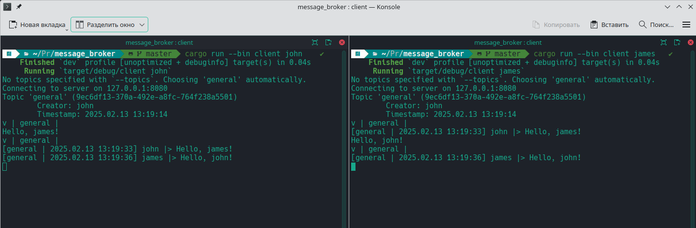

# message_broker



## Building & running

### Simlpest case

Launch local server:
```bash
$ cargo run --release --bin server
```

Launch local client:
```bash
$ cargo run --release --bin client -- your_username --topics topic --topics anothertopic
```

### With arguments

Server accepts optional listen socket and:
```bash
$ cargo run --release --bin server --address 0.0.0.0:1234 --state-file custom_save.bin
```

Client accepts optional server socket address:
```bash
$ cargo run --release --bin client -- your_username --topics topic --address 0.0.0.0:1234
```

## About `message_broker`

### This is a simple CLI chat.

- Communication protocol: `capnproto` over plain TCP connection. I picked it for great potential performance.

- RPC system: `capnproto-rpc`.

- Data storage: `ConcurrentList<T>` - in-memory container that supports any amout of concurrent readers and writers. It is also lockfree, as long as you only read and append to the container.

It uses `tokio` as the async runtime. Uses `serde` to save/load server state into file.

### Quitting

Type `/q` instead of the message to stop the client.

```
$ cargo run --bin client ussur --topics general
Connecting to server on 127.0.0.1:8080
Topic 'general' (026b3f1a-efa5-4b92-9c4a-4e62e59dddec)
        Creator: quiet_dan
        Timestamp: 2025.02.13 11:18:55
v | general |
/q
All work done
$
```

### Sending messages

Just type the line with the message into chat:
```
...
v | general |
Just type your message here and press enter.
[general | 2025.02.13 12:58:51] ussur |> Just type your message here and press enter.
```

Also, you can pipe into `stdin` to automate message sending:
```bash
$ cat my_file | cargo run --bin client -- my_username
```

### Topics

Messages are split into topics (even though messages from all topics are stored in one single `ConcurrentList<T>`).

Client can list all topics it is subscribed to by typing `/topic` instead of the message

```
$ cargo run --release --bin client --topics general --topics other
...
v | general |
/topic
Available topics: ["general", "other"]
/topic other
v | other |
...
```

## About `ConcurrentList<T>`

[`ConcurrentList`] supports any amount of concurrent/parallel readers and writers.
List is accessed via `Arc<Self>::reference()` which is a [`ConcurrentListRef<T>`].

[`ConcurrentListRef<T>`] can be used to `.push(T)` and `.remove_at(index)` safely.
[`ConcurrentListRef<T>`] is also a double-sided iterator. And can be manually moved in the list.
[`ConcurrentListRef<T>`] is safe to clone. Cloning it is the recommended way to share access to the list. 

[`ConcurrentList`] is guaranteed to be almost* lock-free.
 
*Almost: in practice, there will be zero locks.
But if you have a lot of readers that will try to access new elements in the time they are written
you may have less than 0.1% of locks. In these 0.1% cases - readers/writers will spin on the RwLock
a few times. Effect is essentially negligible.

```rust
use std::sync::Arc;
use std::sync::RwLockReadGuard;
use std::ops::Deref;
use broker::concurrent_list::{ConcurrentList, ConcurrentListRef};

fn main() {
    // 256 chunk size is fairly optimal. More chunk size = more performace but less efficient allocations. 
    let list = ConcurrentList::<String>::new(256); 
    let mut threads = vec![];

    for _ in 0..10 { // Any amount of parallel accesses
        let handle: ConcurrentListRef<String> = list.reference();
        let thread = std::thread::spawn(move || do_something(handle));
        threads.push(thread);
    }

    threads.into_iter().for_each(|thread| thread.join().unwrap());
}

fn do_something(mut handle: ConcurrentListRef<String>) {
    handle.push("An element".to_string());

    handle.drain_backwards(); // Go to the very first element.

    for elem in handle {
        let elem: RwLockReadGuard<'_, Option<String>> = elem;
        match elem.deref() {
            None => continue,
            Some(string_ref) => println!("{string_ref}"),
        };
    }
}
```